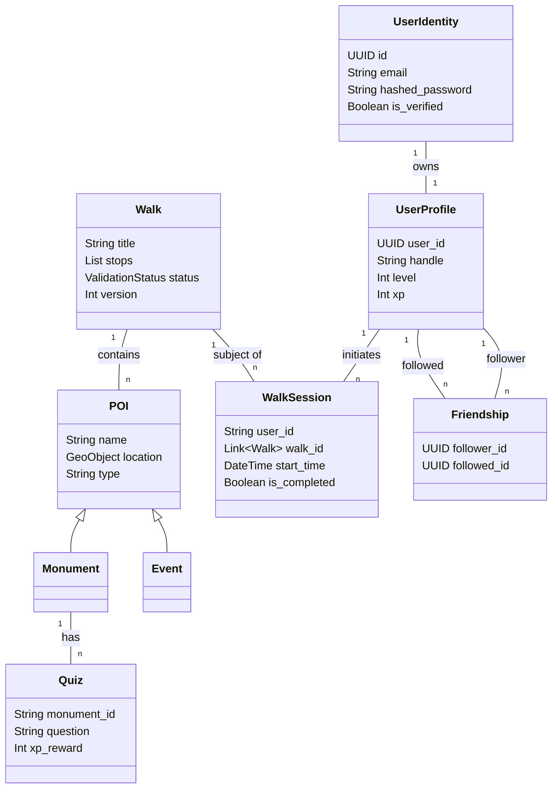

# Data Models Documentation

This document describes the data architecture of the application, including core entities, detailed schemas, and their relationships.

## Entity Relationship Diagram

## 1. User System

### UserIdentity (`user_identities`)
Stores authentication credentials and account status.
- **id**: `UUID` (Primary Key)
- **email**: `str` (Unique)
- **hashed_password**: `str`
- **is_active**: `bool`
- **is_verified**: `bool` (Email verification status)

### UserProfile (`user_profiles`)
Stores public-facing user data and gamification progress.
- **user_id**: `UUID` (Foreign Key to UserIdentity)
- **handle**: `str` (Username)
- **level**: `int` (Current player level)
- **xp**: `int` (Experience points)
- **stats**: `UserStats`
    - `distance`: `str` (e.g., "42km")
    - `cities`: `int`
    - `secrets`: `int`
- **collection**: `List[str]` (IDs of collected items)

### ActivityLog (`activity_logs`)
Logs significant user actions for auditing or feed generation.
- **user_id**: `UUID`
- **action**: `str` (e.g., "WALK_COMPLETED")
- **target_id**: `str`
- **timestamp**: `datetime`

## 2. Points of Interest (POI)

### POI (Base Class) (`pois`)
Represents a geographic location of interest. Uses 2dsphere index on `location`.
- **id**: `PydanticObjectId`
- **name**: `str`
- **description**: `str`
- **location**: `GeoObject` (`type: Point`, `coordinates: [lon, lat]`)
- **images**: `List[ImageMedia]`
- **hidden_description**: `str` (Revealed upon unlocking)
- **hidden_media**: `List[ExternalResource]`

### Monument (Extends POI)
Specific fields for permanent landmarks.
- **architectural_style**: `str`
- **built_year**: `int`
- **opening_rules**: `List[ScheduleRule]`

### Event (Extends POI)
Specific fields for temporary occurrences.
- **start_time**: `datetime`
- **end_time**: `datetime`
- **ticket_link**: `HttpUrl`

## 3. Walks

### Walk (`walks`)
An ordered collection of POIs creating a route.
- **title**: `str`
- **description**: `str`
- **stops**: `List[Link[POI]]` (Ordered list of POI references)
- **path**: `GeoLineString` (The actual route geometry)
- **difficulty**: `Difficulty` (Easy, Medium, Hard)
- **status**: `ValidationStatus` (DRAFT, GREEN, YELLOW, RED, PUBLISHED)
- **version**: `int` (Versioning support)
- **previous_version_id**: `Link[Walk]`
- **is_latest**: `bool`

## 4. Exploration & Gamification

### WalkSession (`walk_sessions`)
Tracks a user's active attempt at completing a walk.
- **user_id**: `str`
- **walk_id**: `Link[Walk]`
- **start_time**: `datetime`
- **end_time**: `datetime`
- **unlocked_stops**: `List[PydanticObjectId]` (Progress tracking)
- **is_completed**: `bool`

### QuestState (`quest_states`)
Ephemeral state for checking user's current context (e.g., active navigation).
- **user_id**: `str`
- **active_walk_id**: `str`
- **current_stop_index**: `int`
- **visited_stop_ids**: `List[str]`

### Quiz (`quizzes`)
Trivia associated with Monuments.
- **monument_id**: `str`
- **question**: `str`
- **options**: `List[str]`
- **correct_answer**: `int` (Index)
- **xp_reward**: `int`

## 5. Social

### Friendship (`friendships`)
Directional graph connection between users.
- **follower_id**: `UUID`
- **followed_id**: `UUID`
- **created_at**: `datetime`

### ActivityFeedItem (`activity_feed`)
Denormalized feed items for quick retrieval.
- **user_id**: `UUID` (Who performed the action)
- **type**: `str` (e.g., 'walk_completed')
- **target_id**: `str`
- **metadata**: `dict`
